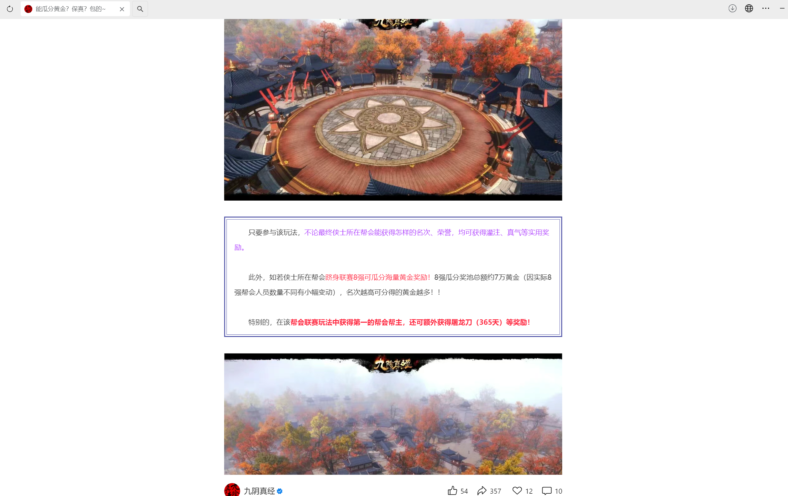
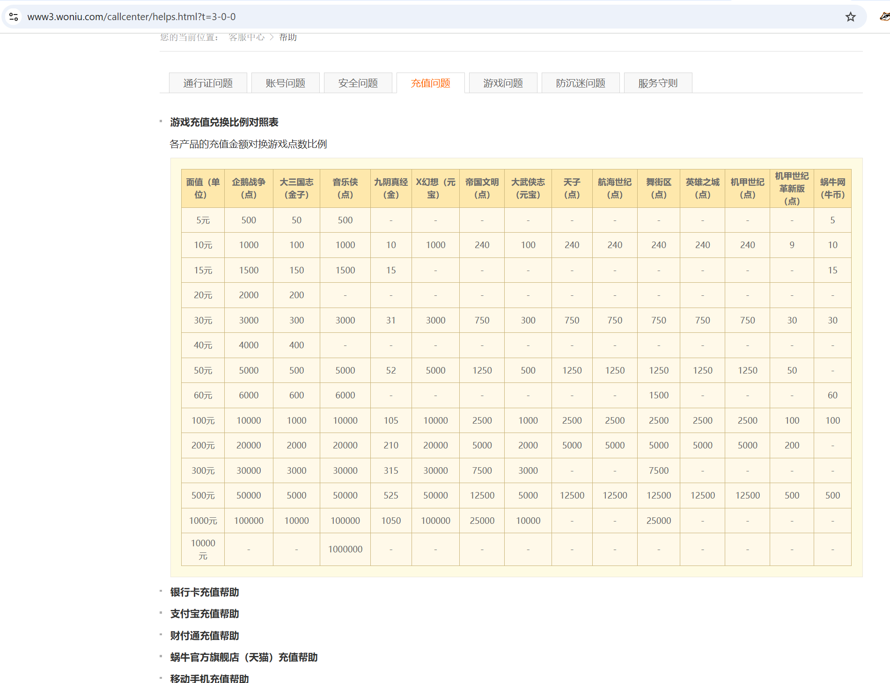
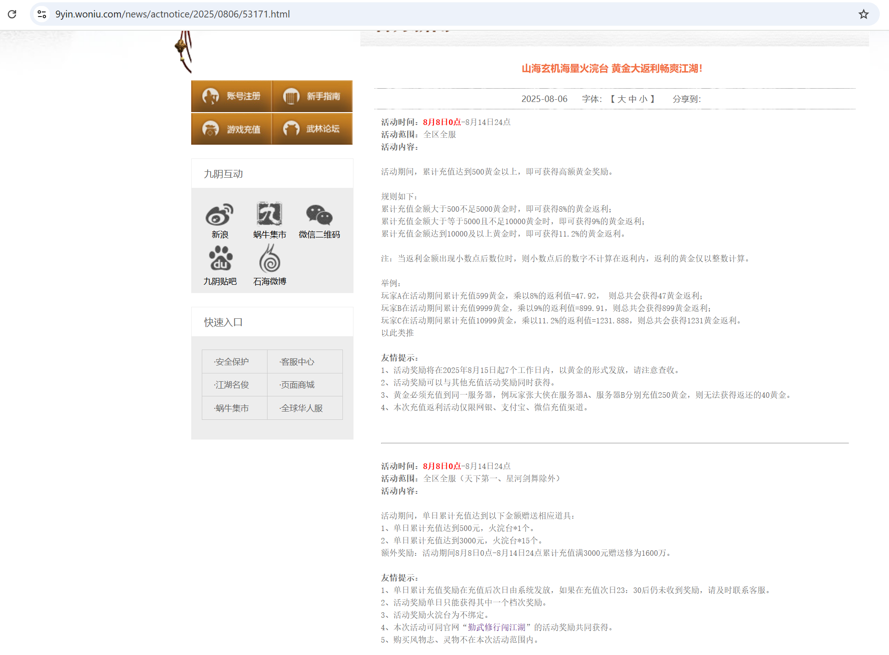
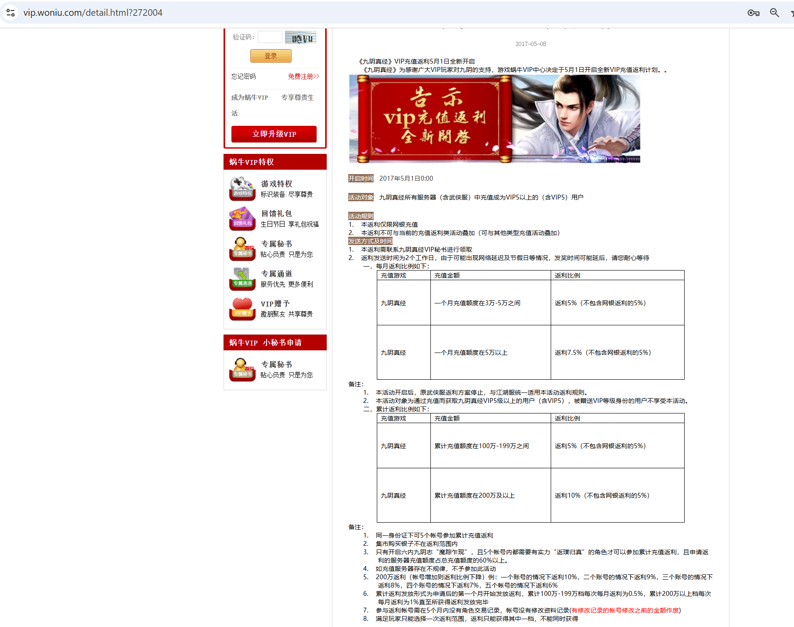

# 当游戏策划学会了"央行放水":蜗牛九阴的饮鸩止渴

> *作为一个从2022年8月到2025年11月间,在《九阴真经》(端游)花费时间和金钱的玩家,我曾以为自己理解这个游戏的一切。直到昨晚,我看到官方推出"瓜分7万黄金"的活动,才意识到:**这款游戏要以我最熟悉的方式失去活力——货币增发。***
> 
> *这是一份解毒报告。*

---

## 一个不对劲的活动

昨晚睡前,玩家群里有人转发了蜗牛九阴的最新活动:帮会联赛瓜分7万黄金。

当时困意正浓,我扫了一眼就睡了。但早上醒来,一个念头突然闪过——**这事不对劲**。

我翻出手机,找到官方公众号的完整公告:

**官方公告来源:**

- 发布时间: 2025年12月9日 17:51

- 原始链接: [九阴真经官方微信公众号](https://mp.weixin.qq.com/s/3jNnXU7_xQTUa5oC0bYAGQ)

- 备份: [PDF存档](./evidence/官方公告.pdf) | [文字全文](./evidence/官方公告原文.txt)
  
  *(由于微信公众号的技术限制,Web Archive无法存档此链接,故采用多重备份方式)*

> "首先,小九为侠士们简单介绍一番,即将在新版本中与侠士们见面的新帮会玩法——龙争虎斗联赛。
> 
> 早在新版本前瞻时,小九就曾告知各位侠士,该玩法暂定于未来新服中开启。因此,待贺岁新版正式公测,侠士们可于与贺岁新版一同开启的新服中体验该玩法。
> 
> 此外,由于其他区服侠士对此玩法也较为期待。故官方暂定于未来版本中,计划以跨服的形式为其他区服开启该帮会玩法。
> 
> ...
> 
> 此外,如若侠士所在帮会跻身联赛8强可瓜分海量黄金奖励!**8强瓜分奖池总额约7万黄金**(因实际8强帮会人员数量不同有小幅变动),名次越高可分得的黄金越多!!"

**[截图1: 官方活动公告 - 7万黄金奖励]**

看完公告,我意识到了三个关键信息:

1. **奖励是游戏币(黄金),不是现金**
2. **7万黄金会流入市场** — 这在九阴十几年的运营史上前所未有
3. **"计划以跨服形式开启"** — 暗示这可能不是一次性活动,而是常驻化

作为一个曾经深度参与这个游戏经济系统的玩家,我立刻明白:**这是央行放水,而且是饮鸩止渴式的放水。**

---

在正式分析这个活动之前,我需要坦白我的身份:**一个从2022年8月服开始,几乎每个新服都去过的普通氪金玩家。**

**拿最后为了新区新建的一个账号举例:**

- **官方充值记录:** 9,000+元
- **实际投入:** 32,000元(差额来自线下官银交易、宝物、商城外观)
- **最终售价:** 6,000+元
- **净亏损:** 26,000元 **(资产蒸发率81%)****

### 数字背后的真相

这些数字揭示了三个关键事实:

**1. 官方数据的虚假性**
官方只看到我消费的28%(9000元)，其他的72%，除了商城外观，剩下40%流向了灰色市场——线下官银交易、宝物买卖、帮会内部RMB互助。**官方永远不知道玩家的真实消费。**

**2. 新服模式的成瘾性**
每个新服都给你一个"公平起跑线"的幻觉。你告诉自己"这次理性氪金,就花5000"或者就花100块三个月的名俊（九阴真经的实质月卡的名字）钱,结果一个月后就破万,三个月后又是几万投入。**无限重启的游戏,就是无底洞的氪金。**

**3. 账号的真实贬值率**
投入3.2万,只能卖6千,**这还是在货币体系"稳定"的前提下。**

---

## 一个运行了十几年的货币体系

《九阴真经》运营已逾12年,是典型的Pay-to-Win模式。游戏内的硬通货"黄金",长期与人民币保持近乎**1:1的锚定汇率**——这种稳定性,曾经是游戏经济系统健康的基石。

### 黄金与人民币的三个交汇点

**第一,官方充值渠道:**

大部分普通玩家的充值方式:

- ***日常充值返点:** 充100返105黄金(约5%返利) → [返点规则详情](https://www3.woniu.com/callcenter/helps.html?t=3-0-0)

**[截图2: 日常充值返点规则]**

*表格展示了不同充值档位的返点比例。以九阴真经为例:充100元获得105黄金(100本金+5返点),基础返点约5%。*

- **新服开服活动:** 每个新服开启时持续6天,充值有额外返利 → [2025年8月活动公告](https://9yin.woniu.com/news/actnotice/2025/0806/53171.html)

**[截图3: 新服返利活动]**

- **VIP5+专属返利:** 累计充值达到一定额度后,返利比例提升至5%-10% → [VIP返利详情](https://vip.woniu.com/detail.html?272004)

**[截图4: VIP返利规则]**

但这些返利对普通玩家来说门槛很高,大部分人只能享受基础的5%返点,导致**1元人民币 ≈ 1黄金**的基准汇率。

**第二,玩家间的灰色交易:**

由于官方充值"不划算",大量玩家选择线下购买官银(黄金可以兑换成官银用于交易):

- **1黄金 = 10两官银**
- **1锭官银(1000两) = 75-82元人民币**
- 线下商人长期以75-78元的价格出售,比官方便宜约20%

官方也支持官银买卖,在官方集市里:

- 价格通常是**80元/锭**
- 高于线下是因为官方抽取交易手续费
- 但这是**最安全**的交易途径

交易安全等级(从高到低):

1. 官方集市(最安全,但价格高+手续费)
2. 线下大商人(相对安全,价格低)
3. 线下熟人交易
4. 陌生人线下交易(最危险,可能被骗/封号)

**第三,账号资产的保值性:**

由于货币体系十几年来极其稳定,九阴的账号形成了独特的"避险资产"属性:

- 账号交易市场流通性好(即使玩家不足万人)
- 账号价值相对保值
- 甚至有人用九阴账号做资产配置(规避其他风险)

这种稳定性,构成了游戏经济生态的**信用基础**。

---

说完了蜗牛九阴多年自成一派的经济交易系统,我们回到正题:

**这个瓜分7万黄金的活动,问题在哪?**

### 第一重:这不是真金白银,而是数据修改

**奖励是游戏币,不是现金。**

这意味着游戏运营团队只需要修改数据库就能"发放奖励",不需要公司拿出真金白银。但因为游戏成熟的交易体系,**这7万黄金是有价值和购买力的,是可以换成人民币的。**

换算一下:

- 7万黄金 = 7万两官银 = 700锭官银
- 按75-82元/锭的市场价 ≈ **5.25-5.74万元人民币的购买力**

**官方修改黄金数据,在现实中的对应行为,就是央行增发货币。**

### 第二重:货币增发必然导致通货膨胀

众所周知,央行增发货币是货币政策的体现,理论上是为了刺激市场经济。

但无论市场经济有没有被刺激起来,**物价水平一定会受到影响** — 因为源头突然多了一堆"本来在市场之外的钱"。

在九阴里,这意味着:

- **宝物系统**(750黄金换1个高级宝物) → 黄金贬值后,宝物相对升值
- **官银汇率**(1锭=75-82元) → 可能跌至60元甚至更低
- **所有以黄金计价的交易** → 购买力全面下降

### 第三重:账号"避险资产"属性的崩溃

九阴多年来货币系统极其稳定,导致了一个独特现象:**玩家把游戏账号当作避险资产。**

为什么?

- 除了众所周知的"游戏洗钱"问题
- 更重要的是:**九阴账号基本保值**
- 这种保值性,来自于货币体系的长期稳定

在一个玩家体量不足万人的游戏里,官方账号交易市场依然有不错的流通性,**交易活跃度本身就是游戏生命力的体现。**

**但7万黄金流入后呢?**

- 账号贬值 → 交易意愿下降
- 保值属性消失 → "避险资产"逻辑崩塌
- 市场流动性枯竭 → 游戏死亡螺旋启动

### 第四重:多米诺骨牌效应已经排好

结合前三点,如果这个活动常驻化(官方公告暗示"计划以跨服形式开启"),持续的货币增发将触发**连锁反应:**

**短期(1-3个月):**

- 7万黄金流入市场
- 宝物、装备等核心资源价格开始膨胀
- 玩家短期内感觉"福利真好"

**中期(4-6个月):**

- 黄金购买力明显下降
- 官银对人民币汇率松动,从80跌至60甚至更低
- 老玩家开始察觉不对,部分人抛售资产离场

**长期(7个月+):**

- 账号保值率可能继续下滑
- 新玩家看到账号贬值案例,入坑意愿下降
- 付费玩家可能产生"充值=贬值"的认知
- 游戏收入可能下降 → 可能推出更激进的活动 → 存在进入恶性循环的风险

**更致命的是,这个游戏还有一个被忽视的X因素...**

### 第五重:职业玩家与资源垄断的风险

由于玩家群体萎缩,九阴形成了一个独特的**"熟人社会"结构:**

**规模对比:**

- 一个10万玩家的游戏,10个头部帮会管理认识5000人 → **影响力5%**
- 九阴不足1万玩家,10个头部帮会管理认识5000人 → **影响力50%**

**这意味着什么?**

九阴存在一批**职业玩家** — 靠游戏赚钱的自由职业者:

- 线下官银交易商
- 职业代练
- 帮会管理(收管理费/资源分成)

这些人因为玩家总量小而**影响力被极度放大**。他们之间:

- 网上社交圈高度重合
- 线下聚会、见面
- 形成了实质上的"利益共同体"

**历史已经证明了这一点:**

九阴曾在"剑无名服"和"西风烈服"出现过:

- 游戏管理和代练把控游戏核心资源
- 导致普通玩家体验极差
- 官方不得不**修改Pay-to-Win规则**来平衡

**这个问题直到现在依然存在。**

**所以,7万黄金的分配权,实际上掌握在这个小圈子手中:**

- 如果他们选择集体"套现离场"?
- 如果他们操纵活动规则,垄断奖励?
- 对游戏经济的冲击将是**灾难性的**

---

## 这个活动会如何收场?

### 乐观情况(概率<20%)

官方紧急推出"黄金回收机制"(新的氪金坑/消费陷阱),吸收超发货币,勉强维持平衡。

类似现实中的"加息"政策 — 通过提高"储蓄"收益来回收流动性。

### 现实情况(概率~60%)

**第1-3个月:**

- 新服热闹,8强帮会狂欢
- 玩家群社交媒体（指百度贴吧九阴吧）一片"官方良心"
- 短期数据亮眼,策划完成KPI

**第4-6个月:**

- 黄金贬值开始显现
- 官银汇率从80跌到65左右
- 老玩家察觉不对,开始抛售资产
- 账号交易市场价格松动

**第7个月起:**

- 付费玩家发现"充值即贬值"
- 新服开服数据开始下滑
- 游戏收入暴跌
- 官方推出更激进的活动试图挽救
- **恶性循环启动**

### 最坏情况(概率~20%)

如果工作室盯上这个活动,批量刷号参赛:

- 黄金流入速度可能远超预期
- 市场可能在短期内受到严重冲击
- 官银汇率可能大幅下跌
- 账号交易市场可能受到严重影响

**无论哪种情况,这都存在用游戏长期健康换取短期数据的风险。**

---

## 为什么不用现金奖励?

按照正常的游戏项目运营方式,真正的福利应该是**真金白银**。

就像蜗牛九阴多年前,创始人石海还重视这个项目的时候,曾经举办过线下竞赛,奖励就是**现金**。

**而现在这个活动,居然是通过修改数据发放奖励,而非真实的现金。**

这说明了什么?

### 公司层面的信号

**游戏公司本身对这个项目的不重视,以及对投资回报率的低估。**

公司层面不相信:

- 给这个项目投7万现金能得到正向回报
- 这个项目还有长期价值
- 玩家值得被认真对待

**所以才会用"改数据"这种零成本的方式,来制造"福利"的假象。**

### 策划层面的困境

策划可能想要现金奖励,但公司不批预算。

于是只能用游戏币"画饼":

- 短期内制造热度
- 完成这个季度的KPI
- 至于半年后会不会崩盘?
- **那已经不是现任策划的问题了**

也许策划在赌:

- "如果活动效果好,以后公司就批预算了"
- "如果效果不好,反正我也可以离职"

### 委托代理问题的残酷

**这就是经济学中的"委托代理问题":**

决策者(策划)不承担后果(游戏死亡):

- 游戏做砸了?大不了离职
- 简历上写"负责某大型活动策划,数据增长X%"
- 至于游戏本身的寿命?不在考核范围内

**而游戏的长期生命,玩家的信任,货币体系的稳定性,统统可以牺牲掉。**

---

## 附:

### 关于九阴的收入(基于玩家观察的推测)

**服务器现状:**
- 运营服务器: 13个
- 真实活跃玩家: 约6000人
- 高活跃服(双方各500人): 3个
- 中活跃服(双方各200-300人): 4个
- 其余为低活跃服

**基于:**
- 个人多服游戏经历(2022-2025)
- 服务器PVP参与人数统计
- 内功研修榜消费排名对比
- 新服/老服消费差异观察

**保守估算年收入: 2500-4000万元人民币**

**验证逻辑:**
- 对比2017年客户端游戏收入(7.1亿/9个月)
- 当前玩家数约为2017年的10-15%
- 单人消费可能持平或略升(剩余铁粉)
- 综合推算当前收入约为2017年的5-10%

**注:**
- 以上为基于公开信息和个人游戏经历的推测,非官方数据
- 本文基于公开信息和个人经历,不构成投资建议
- 游戏名称和公司名称仅作分析用途,无意诋毁任何公司或产品
- 文中数据为个人记录,可能存在记忆偏差
- 所有官方链接截至2025年12月10日有效
- 本文由作者原创,并使用AI辅助润色排版

**数据完善邀请:**

如果你也是九阴玩家,欢迎在评论区分享:
- 你所在服务器的活跃人数观察
- 你了解的消费排名情况  
- 你认为这个估算是否合理

多方数据的交叉验证,能让我们更接近真相。
